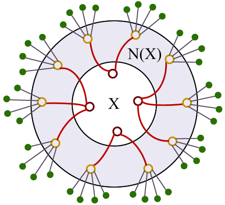

# Neighborhood Matters: Influence Maximization in Social Networks with Limited Access
+ Proposed a two-stage seeding model to overcome the access limitation commercial advertising, utilizing *friendship paradox* to reach crucial nodes through trivial seeds. Notably, we mathematically prove the existence of set-wise friendship paradox, providing theoretical fundation for our seeding model.
+ Proposed both non-adaptive and adaptive algorithms to maximize the influence spread. Specifically, in the non-adaptive case, a two-stage coordinate descent framework is designed to decide the discount allocation. In the adaptive case, a series of algorithms are devised with performance guarantee. Notably, our best algorithm achieves greater approximation ratio than previous work, even under our harsher settings.
+ Implemented the proposed algorithms along with previous baselines. Adaptive approaches generally extend diffusion coverage by 20% compared with non-adaptive counterparts
+ Switched to *C#* after completing the *Python* version. Improved data structures reduced mean memory consumption by 40% and accelerated the same algorithms by 10 times

---
Datasets of social networks are obtained from [Stanford Network Analysis Project](http://snap.stanford.edu/index.html):

1. [Wikipedia vote network](http://snap.stanford.edu/data/wiki-Vote.html) (7115 nodes, 103689 edges)
2. [Condense Matter collaboration network](http://snap.stanford.edu/data/ca-CondMat.html) (23133 nodes, 93497 edges)
3. [DBLP collaboration network and ground-truth communities](http://snap.stanford.edu/data/com-DBLP.html) (317080 nodes, 1049866 edges)
4. [LiveJournal social network](http://snap.stanford.edu/data/soc-LiveJournal1.html) (4847571 nodes, 68993773 edges)
